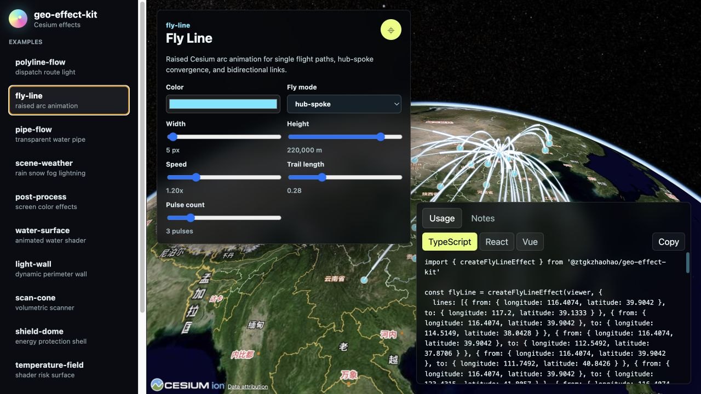

# geo-effect-kit

面向 Cesium 的框架无关动效 SDK，适合 WebGIS 大屏、应急指挥、数字孪生、三维地图和 AI 辅助地理可视化项目。

[English README](./README.md)


## 在线体验

- 在线 Demo：[tzxzhaohao.github.io/cesiumDesign](https://tzxzhaohao.github.io/cesiumDesign/)
- npm 包：[`@ztgkzhaohao/geo-effect-kit`](https://www.npmjs.com/package/@ztgkzhaohao/geo-effect-kit)
- AI/MCP 包：[`@ztgkzhaohao/geo-effect-kit-mcp`](https://www.npmjs.com/package/@ztgkzhaohao/geo-effect-kit-mcp)



## 特性

- 接收已有 Cesium `Viewer`，不接管宿主项目的地图初始化。
- TypeScript API，React、Vue、原生项目都可以使用。
- 内置雷达扫描、水波扩散、飞线、水管流动、水面、光墙、锥形扫描、护盾、温度场、GIF 火点、天气、后处理和路线流光等效果。
- 统一生命周期：`update`、`show`、`hide`、`flyTo`、`destroy`。
- 提供机器可读的效果 manifest，方便 AI 智能体读取。
- 提供可选 MCP server，用于查询效果 schema 和集成示例。
- 支持 React、Vue、Vite 和原生 TypeScript Cesium 项目接入。

## 安装

```bash
pnpm add @ztgkzhaohao/geo-effect-kit cesium
```

Cesium 是 peer dependency，由宿主项目负责版本、静态资源、`CESIUM_BASE_URL` 和 `Viewer` 初始化。

## 最小用法

```ts
import 'cesium/Build/Cesium/Widgets/widgets.css'
import { Viewer } from 'cesium'
import { createRadarScanEffect } from '@ztgkzhaohao/geo-effect-kit'

const viewer = new Viewer('cesiumContainer')

const radar = createRadarScanEffect(viewer, {
  center: { longitude: 116.391, latitude: 39.907 },
  radiusMeters: 22000,
  color: '#36d6ff',
  scanDurationMs: 3600,
})

radar.flyTo()

// 页面、图层或 Viewer 销毁前调用
radar.destroy()
```

## 为什么做这个项目

很多 Cesium 项目都会反复实现雷达扫描、飞线、路径流光、水面、光墙、风险热力面、火点标记等效果。`geo-effect-kit` 把这些常见效果封装成小而明确的 TypeScript API，可以直接接入已有 Viewer，不改变你的地图初始化和业务架构。

仓库还提供结构化效果 manifest 和可选 MCP server，方便 AI 编程助手查询参数、生成示例代码，而不是从 demo 里猜用法。

## 文档

- [快速开始](./docs/getting-started.md)
- [Vite 与 Cesium 静态资源](./docs/vite-cesium.md)
- [React 接入](./docs/react.md)
- [Vue 接入](./docs/vue.md)
- [AI 智能体与 MCP](./docs/ai-agents.md)
- [发布流程](./docs/release.md)

效果级知识文件：

- [`knowledge/effects`](./knowledge/effects)
- [`knowledge/docs`](./knowledge/docs)

## Demo

```bash
pnpm install
pnpm --filter geo-effect-kit-demo dev
```

在线 Demo：[https://tzxzhaohao.github.io/cesiumDesign/](https://tzxzhaohao.github.io/cesiumDesign/)

## AI 智能体

智能体应优先读取结构化知识文件：

- `knowledge/effects/*.effect.json`：效果 ID、导入名、参数、方法、示例和注意事项。
- `knowledge/docs/*.md`：每个效果的详细说明和迁移建议。
- `@ztgkzhaohao/geo-effect-kit-mcp`：支持 MCP 的智能体可直接查询效果信息。

启动 MCP server：

```bash
npx @ztgkzhaohao/geo-effect-kit-mcp
```

## 开发

```bash
pnpm install
pnpm typecheck
pnpm test
pnpm build
```

## 参与贡献

欢迎提交 issue 和 pull request。适合第一次参与的方向包括：新增一个效果示例、补充 React/Vue 接入文档、优化 demo 控件、完善 `knowledge/effects` 中的效果 manifest。

贡献流程和公开 API 约定见 [CONTRIBUTING.md](./CONTRIBUTING.md)。

## 许可证

MIT
